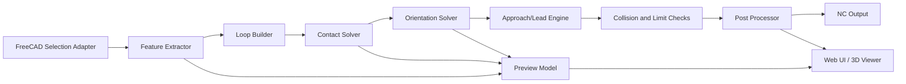

# FreeCAD-pohjainen viisteytys- ja deburr-engine FreeCADiin

## Johdon yhteenveto

Toteuttamiskelpoinen suunta on rakentaa **oma feature-pohjainen deburr/chamfer-engine**, joka käyttää FreeCADia geometrian, valintojen ja 3D-esikatselun alustana, mutta ei yritä pakottaa koko ongelmaa nykyisen CAM Surface -toiminnon sisään. Syynä on se, että FreeCADin 3D Surface osaa kyllä työstää valittuja pintoja ja käyttää OpenCamLibia, mutta sen rotaatio-ominaisuudet ovat dokumentaation mukaan rajalliset: rotaatiopolut koskevat koko mallia, eivät tiettyjä valittuja pintoja, ja 4. akselin simulointi ei ole sisäisessä CAM-simulaattorissa tuettu. Tämä tekee siitä hyvän **geometriamoottorin ja referenssin**, mutta huonon ytimen juuri reunaviisteiden, deburrin ja 3+2 / TCP-moodien kontrolloituun tuotantoon. citeturn32view0turn38view0turn35view0

MVP kannattaa rajata näin: käyttäjä valitsee FreeCADissa pinnat tai reunat, engine tunnistaa niistä loopit, muodostaa näytteistetyn feature-polun, ratkaisee työkalun kontaktin joko **pallopäällä** tai **viistemyllyllä**, ehdottaa vakio-orientaation per loop, ja postaa ensin turvallisen **indexed 3+2** -ohjelman. Vasta tämän jälkeen kannattaa lisätä **TCP/G43.4** -tila ja sen jälkeen vasta **samanaikainen 5-akseli**, koska TCPC helpottaa ohjelmointia pitämällä ohjelmoidun työkalunkärjen paikan avaruudessa vakiona pyörivien akseleiden liikkuessa, kun taas indexed 3+2 voidaan toteuttaa ilman jatkuvaa 5-akselista interpolaatiota. citeturn37view0turn32view1

Nykyinen prototyyppisi on hyvä lähtökohta juuri tähän polkuun: se on jo **CSV-pisteisiin perustuva**, sillä on tilamallit ja asetusten persistointi, erillinen GUIDANCE/preview-ajatus sekä selainpohjaisen esikatselun fallback silloin, kun QtWebEngine ei ole käytettävissä FreeCADin Python-ympäristössä. Käytännössä sinun ei tarvitse aloittaa nollasta, vaan korvata nykyinen “CSV in → NC out” -ydin **feature extraction → solver → toolpath → post** -ketjulla. fileciteturn0file3

Suositus coding agenteille on yksiselitteinen: **älkää aloittako TCP:stä**, vaan rakentakaa ensin deterministinen edge/face-engine, joka tuottaa yhden loopin kerrallaan tarkastettavan työkalukeskipistepolun ja erillisen “suggested orientation” -tuloksen. Kun tämä toimii, postprosessorille voi lisätä erilliset moodit: **indexed**, **TCP**, ja myöhemmin **simultaneous**. Tämä jakaa riskin oikein, tekee testauksesta hallittavaa ja sopii myös siihen, miten FreeCADin nykyinen CAM-keskustelu jäsentää 2.5D-, 3D-, indexed multiaxis- ja continuous 5-axis -tapaukset. citeturn32view1turn37view0

## Tavoite, rajaus ja avoimet oletukset

Tavoite ei ole “yleinen 5-akseli-CAM”, vaan **reuna- ja pintaperusteinen viisteytys/deburr-engine**, joka tarvittaessa käyttää FreeCADin geometriatoimintoja ja OpenCamLibia, mutta jonka päätuote on **hallittu, konekohtaisesti turvallinen NC-ulostulo NTX-tyyppiselle koneelle**. FreeCADin omassa keskustelussa juuri tämä rajaus on järkevä: indexed moniakseli on käytännössä 3D-työstöä eri työskentelytasoilla, kun taas jatkuva 5-akseli lisää kinematiikka- ja ohjauskompleksisuutta merkittävästi. citeturn32view1turn37view0

MVP:n ominaisuudet kannattaa rajata seuraavasti: käyttäjä valitsee pinnat tai reunat, engine muodostaa loopit, tunnistaa ulkoiset ja sisäiset ketjut, laskee paikalliset normaalit sekä tangentit, tuottaa **chamfer mill**- tai **ball mill** -kontaktin, lisää lähestymisen ja poiston, ehdottaa kiinteän työkaluakselin per loop, ja postaa ensin **indexed 3+2** -NC:n. Tämän jälkeen seuraavat laajennukset ovat perusteltuja: automaattinen B/C-optimointi, TCP/G43.4-moodi, holder/shank-kollisiot, samanaikainen 5-akseli ja web-UI:n kautta ajettava jobs/preview-arkkitehtuuri. FreeCADin CAM Surface tukee valittuja pintoja, Use Start Pointia, Step Overia, Boundary Enforcementia ja OCL-pohjaista laskentaa, joten siitä voi ottaa käyttöliittymä- ja parametriajattelua, vaikka itse core kannattaa pitää omana. citeturn38view0turn32view0

Avoimet oletukset pitää nostaa näkyvästi heti alussa, koska ne vaikuttavat suoraan postiin ja turvallisuuteen. Ratkaisematta ovat ainakin: **tarkka NTX-malli**, **ohjauksen versio**, **TCP/RTCP-koodit ja niiden aktivointi-/peruutusjärjestys**, **B/C-akselien todellinen kinematiikka ja ohjelmointikonventio**, **pään ja pöydän pivot-pisteet**, **työkalun referenssipiste** (kärki, pallon keskipiste vai mittapiste), **turvalliset G53/G30-välipositioinnit**, sekä mahdolliset **spindle side / work offset** -konventiot. Nämä pitää ratkaista OEM-manuaalista ennen kuin TCP-postia käytetään tuotantoon. FreeCADin maintainer-keskustelu painottaa samaa asiaa: moniakseli-CAM:ssa työn kappaleen sijainti suhteessa pyörimisakselin keskipisteeseen on kriittinen, ja TCPC/DWO siirtävät osan tästä monimutkaisuudesta ohjaukselle. citeturn37view0

Nykyinen prototyyppi on jo käytännössä konfiguroitava käyttöliittymä tällaiselle engineille: siinä on ohjelmanumero, työkalunumero, B-kulma, syöttö, karan kierrosluku, karan suunta, spindle side, coolant, cutter comp, output folder, GUIDANCE-preview ja asetusten tallennus. Tämä tarkoittaa, että core-logiikan vaihtaminen on tärkeämpi työ kuin UI:n täydellinen uudelleenkirjoitus. fileciteturn0file3

## Tietomalli ja moduuliarkkitehtuuri

Tietomallin kannattaa olla alusta asti selkeä, koska myöhemmin sama data kulkee FreeCADista solverille, solverilta postprosessorille ja sieltä web-UI:n previewhin. Pydantic on tähän hyvä valinta: se validoi tyypit, osaa serialisoida skeemat tyypitysten perusteella ja tuottaa JSON Schemaa, mikä helpottaa sekä REST-rajapintaa että asetusten editoria. FastAPI taas rakentuu OpenAPI- ja JSON Schema -standardien ympärille ja tuottaa automaattisen interaktiivisen API-dokumentaation, mikä tekee agenttien ja ihmisen välisestä työnjaosta sujuvamman. citeturn32view3turn36view1turn29view2

Suositeltu ydintietomalli on tämä:

```python
from enum import Enum
from pydantic import BaseModel, Field
from typing import Literal, Optional

class ToolKind(str, Enum):
    CHAMFER = "chamfer"
    BALL = "ball"

class PathMode(str, Enum):
    INDEXED = "indexed_3plus2"
    TCP = "tcp_g43_4"
    SIM5 = "simultaneous_5x"

class ToolDefinition(BaseModel):
    id: str
    kind: ToolKind
    diameter: float
    corner_radius: float = 0.0           # ball: R = D/2, chamfer: tip radius/flat if any
    included_angle_deg: Optional[float] = None
    tip_flat_diameter: float = 0.0
    gauge_length: float
    stickout: float
    holder_diameter: Optional[float] = None
    holder_length: Optional[float] = None
    reference_point: Literal["tool_tip", "ball_center", "gauge_point"] = "tool_tip"
    calibration_profile: dict = Field(default_factory=dict)

class FeatureLoop(BaseModel):
    id: str
    source_face_ids: list[str] = Field(default_factory=list)
    source_edge_ids: list[str] = Field(default_factory=list)
    loop_kind: Literal["outer", "inner", "open_edge", "shared_edge"]
    closed: bool
    convexity: Optional[Literal["convex", "concave", "flat"]] = None
    samples_xyz: list[tuple[float, float, float]]
    tangents_ijk: list[tuple[float, float, float]]
    normals_a_ijk: list[tuple[float, float, float]] = Field(default_factory=list)
    normals_b_ijk: list[tuple[float, float, float]] = Field(default_factory=list)

class ChamferOperation(BaseModel):
    id: str
    tool_id: str
    feature_loop_ids: list[str]
    mode: PathMode
    target_width: float
    target_depth: float = 0.0
    stock_to_leave: float = 0.0
    stepover: Optional[float] = None
    approach_style: Literal["normal_lift", "tangent_line", "arc", "dogleg_safe"] = "tangent_line"
    retract_style: Literal["normal_lift", "tangent_line", "arc", "dogleg_safe"] = "normal_lift"
    lead_in_len: float = 2.0
    lead_out_len: float = 2.0
    safety_lift: float = 3.0

class ToolpathPoint(BaseModel):
    seq: int
    xyz: tuple[float, float, float]
    ijk: tuple[float, float, float]              # tool axis
    b_deg: Optional[float] = None
    c_deg: Optional[float] = None
    contact_xyz: Optional[tuple[float, float, float]] = None
    contact_normal_ijk: Optional[tuple[float, float, float]] = None
    feed: Optional[float] = None
    motion: Literal["rapid", "feed", "lead_in", "lead_out", "approach", "retract"]
    flags: dict = Field(default_factory=dict)
```

Tämä malli pitää erottaa kahteen kerrokseen. Ensimmäinen on **feature-data**, joka tulee FreeCADista ja on mahdollisimman lähellä geometriaa. Toinen on **machine path data**, joka sisältää jo orientaation, feedit, turvaliput ja postauksen kannalta tarpeellisen tilan. Tämä erotus estää sen, että konekohtainen postilogiikka vuotaa geometriakerrokseen. Suoraan sanottuna: `_extract_features()` ei saa tietää mitään G43.4:stä, eikä `post_ntx()` saa yrittää ymmärtää BREP-topologiaa. Sama ajattelu näkyy myös nykyisessä prototyypissäsi, jossa UI, preview ja NC-generointi ovat jo hieman erillään, vaikka nykyinen pipeline on vielä pistepohjainen. fileciteturn0file3



## FreeCAD-integraatio ja geometrian nouto

FreeCADin näkökulmasta tärkein päätös on tämä: käytä FreeCADia **valinnan, topologian, wirejen, offsettien ja previewn lähteenä**, mutta pidä varsinainen deburr/chamfer-engine omassa Python-paketissaan. FreeCADin Part-moduuli tarjoaa TopoShape-rakenteet, alielementit kuten `Vertex#`, `Edge#`, `Face#`, sekä perustoiminnot kuten `makePolygon`, `makeFace`, `makeOffset2D`, `makeWires`, `tessellate`, `findPlane` ja shape-tason validiteetti- ja toleranssifunktiot. Vanha wiki-api kuitenkin varoittaa itsekin olevansa osin vanhentunut ja ohjaa käyttämään generoituja API-dokumentteja tai stubeja, joten agenttien pitää aina tarkistaa käytettävän FreeCAD-version runtime-API eikä lukittautua vanhaan nimeämiseen. citeturn40view1turn40view0turn32view2

MVP:ssä geometrian nouto kannattaa tehdä kahdella polulla. Ensimmäinen polku alkaa **valituista pinnoista**: kerää pinnan rajareunat, kokoa niistä wiret `makeWires()`- tai `sortEdges()`-avulla, tunnista ulko- ja sisäloopit, ja näytteistä jokainen loop yhtenäiseen pisteväliin. Toinen polku alkaa **valituista reunoista**: käytä `sortEdges()` tai `getSortedClusters()`-tyyppistä logiikkaa ketjuttamaan ne jatkuvaksi wireksi. Tämä on kriittistä, koska deburr-operaatiossa käyttäjä usein ajattelee “käsittele nämä pinnat” mutta solver ajattelee lopulta “aja tämä järjestetty looppi tai avoin ketju”. FreeCADin dokumentaatio tukee tätä rakennetta: vanha Part API nostaa `sortEdges` esiin juuri wirejen rakentamiseen, ja generoitu Part-dokumentaatio kertoo `makeWires()`-funktion järjestävän reunat ja yhdistävän ne wireiksi. citeturn40view1turn40view0

Jos haluat hyödyntää olemassa olevaa FreeCAD CAM Surfacea, sitä kannattaa käyttää **vertailugeneraattorina**, ei ytimenä. Dokumentaation mukaan 3D Surface osaa käyttää valittuja pintoja, rajauksia, OCL:n Sample Intervalia, Boundary Enforcementia ja monia kuvioita, mutta rotaatiomoodissa pinnan valinta ei ole käytössä, jolloin Base Geometryn muutokset sivuutetaan. Lisäksi 4. akselin simulointi ei ole sisäisessä CAM-simulaattorissa tuettu, ja ei-end mill -työkalujen FreeCAD→OCL-käännökselle oli dokumentoidusti ainakin 0.19-aikaan rajallinen testikattavuus. Tämän vuoksi “käytä CAM Surfacea ja lisää B/C käsin” on hyvä kokeilu, mutta huono pysyvä arkkitehtuuri. citeturn38view0

Normaalien ja discretizationin kohdalla kannattaa tehdä tämä käytännön sääntö: **MVP käyttää FreeCADin runtime-rajapinnan tarjoamia paikallisia face/edge-metodeja, mutta tallentaa solverille aina valmiit tangentit ja normaalit taulukkoina**. Tämä vapauttaa myöhemmät agentit FreeCAD-version metodieroista. Käytännössä extractorin tehtävä on palauttaa `samples_xyz`, `tangents_ijk`, `normals_a_ijk`, `normals_b_ijk`, ei Face- tai Edge-olioita. Näin myöhempi web-backend voi toistaa laskennan myös ilman aktiivista FreeCAD-instanssia. Tätä tukee myös OpenCamLibin rakenne: se on erillinen kirjasto, jolla on Python-, Node.js- ja selainsidokset, eli laskenta kannattaa tuotteistaa erillisenä kirjastokerroksena eikä sitoa kaikkea FreeCADin GUI-prosessiin. citeturn35view0

Nykyisen prototyypin päälle tämä tarkoittaa konkreettisesti yhtä uutta adapteria: nykyinen käyttöliittymä elää CSV-polkua pitkin, mutta uusi FreeCAD-makro tai työkalukomento kirjoittaa ensin `FeatureLoop`-objektit ja vasta sen jälkeen haluttaessa myös CSV/JSON-previewn. Tämä sopii hyvin nykyiseen GUIDANCE-rakenteeseesi, jossa selainpreview ymmärtää pistelistat ja erillisen “original/deburr” -esityksen. fileciteturn0file3

## Kontaktisolverit ja työstöstrategiat

Pallopää on geometrisesti suoraviivaisin. Jos työkalun säde on \(R = D/2\), haluttu kontaktipiste on \(c\) ja paikallinen kontaktinormaali on \(n\), työkalun keskipiste on

\[
p_{tool} = c + (R + \delta)\,n
\]

missä \(\delta\) on mahdollinen lisäoffset esimerkiksi stock-to-leave- tai varovaiseen “kiss deburr” -tyyliseen ajoon. Tämä on juuri se klassinen offset-surface-ajatus, jota NC-geometriassa käytetään: pallopään tapauksen työkalukeskipisterata on kohdepinnan rinnakkaispinta etäisyydellä \(R\). OpenCamLib tukee nimenomaan `BallCutter`-työkalua, ja yleinen offset-surface-geometria kuvaa pallopään keskusradan tällaisena normaalisuuntaisena siirtona. citeturn35view0turn34search4

Reunadeburrissa pallopään normaali ei yleensä ole yksittäisen pinnan normaali vaan **reunan tukinormaali**. Kahden vierekkäisen pinnan deburrissa käytännöllinen MVP-sääntö on:

\[
n_{edge} = \frac{n_1 + n_2}{\|n_1 + n_2\|}
\]

kun käsitellään konveksia ulkoreunaa ja pinnan normaalit on otettu johdonmukaisesti ulospäin. Tällöin kontaktipiste voidaan sijoittaa joko suoraan näytteistetylle reunalle tai hieman reunan sisään tavoitellun deburr-leveyden mukaan, ja työkalukeskipiste ajetaan tämän `n_edge`-vektorin suuntaisena offsettina. Tämä on erittäin hyvä MVP-solveri, koska se on vakaa, helppo testata ja sopii indexed 3+2 -ajoon lähes suoraan. Sen rajoite on se, että se ei vielä optimoi scallopia tai leikkuukulmaa vapaamuotoisilla pinnoilla. Kinematiikka- ja orientaatiorajoitteiden huomioiminen vasta myöhemmässä vaiheessa on linjassa 5-akselisen työkaluorientaation tutkimuskirjallisuuden kanssa, jossa juuri työkaluakselin suunnan optimointi ja akselien käyttäytyminen nähdään erillisenä optimointikerroksena perusgeometrian päällä. citeturn25academia0turn25academia2

Viistemyllyssä kannattaa erottaa **MVP-solveri** ja **tuotantotason solveri**. Jos työkalun mukana ilmoitetaan sisältyvä kulma \(\beta\), puolikulma on

\[
\alpha = \beta / 2
\]

ja kartiosivun säde aksiaalietäisyydellä \(z\) on

\[
r(z) = r_{tip} + z\tan(\alpha)
\]

missä \(r_{tip}\) on kärjen tasaisen osan tai pyöristyksen “alkusäde”. Kun haluat käyttää tiettyä ring-contact-sädettä \(r_c\), aksiaalinen etäisyys kärjestä tähän kontaktiin on

\[
z_c = \frac{r_c - r_{tip}}{\tan(\alpha)}
\]

ja jos työkaluakseli on yksikkövektori \(u\), työkalun referenssipiste voidaan sijoittaa

\[
p_{ref} = c - z_c u
\]

missä \(c\) on valittu kontaktipiste kohdeviisteellä. Tämä kaava on hyödyllinen riippumatta siitä, tuleeko kontaktipiste pinnalta, reunabisektorilta vai myöhemmästä numeerisesta cone-plane-tangency-ratkaisusta. OpenCamLibin cutter-mallissa tämä vastaa `ConeCutter`-ajattelua. citeturn35view0

MVP:ssä suosittelen käytännössä **kalibroitua viistemyllysolveria**. Eli et yritä ratkaista täydellistä kartio–kohdepinta-tangenttia heti, vaan teet näin: jos käyttäjä valitsee konveksille 90° ulkoreunalle 45°/90°-viisteytyksen leveydellä \(w\), asetat ensin heuristiikan `r_c ≈ w`, lasket `z_c`, ajat testikuponkiin, mittaat todellisen jäljen ja tallennat korjauskertoimen työkalukohtaiseen kalibrointitauluun. Tämä on paljon realistisempi tie kuin yrittää tehdä ensimmäisessä versiossa täydellinen suljettu analyyttinen solver kaikkiin työkalugeometrioihin. Samalla tietomalli pysyy oikein suunniteltuna, koska `ToolDefinition` voi sisältää `calibration_profile`-kentän. Yksinkertainen esimerkki: 90° chamfer mill, kärjen tasainen osa 0.2 mm, tavoiteleveys 0.5 mm, valittu `r_c = 0.5 mm`, jolloin `z_c = (0.5 - 0.1) / tan(45°) = 0.4 mm`. Tämä antaa heti käyttökelpoisen ensimmäisen ajon, jonka jälkeen mittaus korjaa arvon. Tätä kannattaa pitää nimenomaan **MVP-approksimaationa**, ei lopullisena geometriatotuuksena. OCL:n `ConeCutter`-tuki tekee myöhemmän numeerisen tarkennuksen mahdolliseksi. citeturn35view0

Lähestyminen ja poistuminen kannattaa mallintaa omana moottorinaan, ei postin ad hoc -lisäyksinä. Ensimmäiselle pisteelle \(p_0\), tangentille \(t_0\) ja työkaluakselille \(u\) hyvä perussääntö on:

\[
p_{safe} = p_0 - L t_0 + H u
\]
\[
p_{lead} = p_0 - L t_0
\]

missä \(L\) on tangentiaalinen lead-in-pituus ja \(H\) turvallinen nosto työkaluakselin suuntaan. Lopussa sama peilattuna viimeiselle pisteelle. Tämä toimii sekä pallopäällä että viistemyllyllä ja pitää lähestymisliikkeen loogisesti erillään varsinaisesta deburr-jäljestä. FreeCAD CAM Surface -dokumentaatio vahvistaa myös sen, että korkeudet, start point, clearance ja boundary-ajattelu ovat olennaisia erillisiä parametreja, eivät vain postin sivuvaikutuksia. citeturn38view0

| Tila | Hyödyt | Haitat | Pakollinen laskenta |
|---|---|---|---|
| **Chamfer mill** | Tuottaa suoraan viistettä vastaavan jäljen; hyvä klassiseen särmän murtamiseen | Herkkä työkalun todelliselle kärki- ja kulmageometrialle; voi vaatia kalibroinnin | cone-contact, ring-säde \(r_c\), aksiaalinen kontaktietäisyys \(z_c\), kiinteä työkaluakseli tai kontrolloitu orientaatio |
| **Ball mill** | Yksinkertainen geometria; normaali-offset toimii hyvin; helppo laajentaa pintadeburriin | Ei tuota “oikeaa” tasoviistettä yhtä suoraan; jäljen leveys riippuu upotuksesta ja orientaatiosta | kontaktipiste \(c\), normaali \(n\), työkalukeskipiste \(c + Rn\), mahdollinen lisäoffset ja jälkileveyden arvio |

Tämä taulukko tiivistää sen käytännön eron, että pallopää antaa helpon offset-geometrian, kun taas viistemylly vaatii kartiomallin tai kalibroidun approksimaation. OpenCamLib tukee molemmat työkalutyypit (`BallCutter`, `ConeCutter`), joten arkkitehtuurin ei tarvitse lukittua kumpaankaan. citeturn35view0

## Orientaatio, ajomoodit ja postprosessorin turvallisuussäännöt

Työkaluakselin ratkaisu pitää tehdä **machine profile** -kerroksessa, ei yleisgeometrian sisällä. Yleistasolla solveri tuottaa halutun työkaluakselin \(u=(i,j,k)\), mutta **B/C-kulmien laskenta ei ole universaali kaava**, koska se riippuu koneen kinematiikasta: pyöriikö B päässä vai pöydässä, missä järjestyksessä rotaatiot tehdään, mikä on nollasuunta, miten pivotit on mallinnettu ja mikä ohjelmointikonventio ohjauksessa on käytössä. Siksi oikea abstraktio on: geometria ratkaisee `ijk`, koneprofiili ratkaisee `bc` tai jatkuvan inverse kinematics -tuloksen. Tämä on linjassa 5-akselisen CAM:n tutkimuksen kanssa, jossa työkaluakselin orientaatio, akselirajat, singulaarisuudet ja akselien dynaaminen käyttäytyminen ovat oma optimointikerroksensa. citeturn25academia0turn25academia2

Käytännön työnkulun kannattaa olla kolmiportainen. **Indexed 3+2** toimii niin, että jokaiselle loopille päätetään yksi vakio-orientaatio ja kaikki deburr-pisteet ajetaan siinä koordinaatistossa. **TCP/G43.4**-moodissa taas ohjelmoit työkalunkärjen radan kappalekoordinaatistossa ja ohjaus kompensoi lineaariset akselit, jotta kärki pysyy radallaan pyörivien akseleiden liikkuessa. **Samanaikainen 5-akseli** tarkoittaa, että työkaluakseli muuttuu leikkauksen aikana. FreeCADin maintainer-keskustelussa tämä ero on sanallistettu hyvin: indexed multiaxis on 3D-työstöä vaihdetulla työskentelytasolla, continuous 5-axis on rotaatiota työkalun ollessa kiinni materiaalissa, ja TCPC/DWO ovat juuri niitä ohjausteknologioita, joilla CAM:n ei tarvitse itse käsitellä kaikkia pivot-korjauksia. citeturn32view1turn37view0

| Moodi | Käyttötarkoitus | Plussat | Miinukset | Välttämätön laskenta |
|---|---|---|---|---|
| **Indexed 3+2** | Deburr-/viisteytysloopit yhdellä kiinteällä B/C-asennolla | Yksinkertaisin, turvallisin, helpoin testata | Enemmän indeksöintejä, hitaampi monimutkaisilla pinnoilla | loopin oma \(ijk\) → koneprofiilin B/C, turvallinen retract/index/re-approach citeturn32view1turn37view0 |
| **TCP / G43.4** | Kun työkalunkärjen ohjelmointi halutaan pitää osakoordinaatistossa | Helpottaa CAM-puolta; ohjaus pitää kärjen radalla | Vaatii oikein konfiguroidun koneen, oikeat pivotit ja ohjauksen moodit | työkalukärkipolku, \(ijk\) tai B/C, TCP-aktivointi/cancel, pivot- ja length-comp-kontrolli citeturn37view0 |
| **Samanaikainen 5-akseli** | Vapaamuotoiset pinnat, jatkuva akselimuutos | Paras saavutettavuus ja laatu vaikeissa kohdissa | Selvästi suurin riski: kollisiot, unwrap, singulaarisuudet, post-kompleksisuus | jatkuva orientaatiokenttä, inverse kinematics, akselirajat, singulaarisuuden väistö, feed/surface-nopeusohjaus citeturn25academia0turn25academia2 |

NTX-tyyppiseen postiin kannattaa rakentaa jo MVP:ssä kolme turvallisuussääntöä, jotka ovat kovia eikä asetuksilla sivuutettavia. Ensimmäinen on **rotary-before-cut only at safe position**: ennen B/C-indeksointia poistutaan aina kappaleesta turvalliseen välipisteeseen. Toinen on **mode hygiene**: vanhat transformaatio- ja kompensaatiomoodit peruutetaan ennen uuden loopin orientaatiota. Kolmas on **machine profile checks**: jokainen postaus validoi, että pyydetty orientaatio mahtuu akselirajoihin, ettei C-akseli tee turhaa 300° “unwindia”, ja että holder/shank-clearance on hyväksyttävä. Kinematiikkatutkimus korostaa juuri gouging- ja akselikäyttäytymisongelmia sekä singulaarisuuksia; ne pitää tuoda osaksi offset-laskentaa ja orientaatiovalintaa jo ennen lopullista G-koodia. citeturn25academia0turn25academia2

Koska julkinen OEM-dokumentaatio G43.4-/NTX-koodijärjestyksestä ei ole luotettavasti saatavilla verkossa, paras käytännön suositus on tämä: **toteuta TCP-postaus vasta, kun tarkka kone- ja ohjausmanuaali on ladattu projektin lähdedokumentteihin**. Siihen asti indexed 3+2 -posti on oletus. Raportin kannalta tämä on tietoinen riski, ei puute: juuri konekohtainen käskyjärjestys on se osa, jota ei pidä keksiä muistista. FreeCADin moniakselikeskustelu antaa käsitemallin TCPC:n ja DWO:n rooleista, mutta ei korvaa OEM-manuaalia. citeturn37view0

## Verifiointi, preview, web-UI ja AI-agenttien työnjako

Preview pitää jakaa kahteen tasoon. Ensimmäinen taso on **FreeCADin sisäinen 3D-debug-näkymä**, jossa näkyvät loopit, kontaktipisteet, tangentit, kontaktinormaalit, ehdotettu työkaluakseli, lähestyminen ja poistuminen. Toinen taso on **kevyt selainpreview**, joka näyttää saman datan koneesta riippumattomasti. Tämä on erityisen hyvä siksi, että nykyinen koodisi tekee juuri tämän jo nyt: sillä on GUIDANCE-näkymä, joka voi käyttää QWebEngineä tai avata selaimen fallbackina, ja se näyttää pistelistoja, toiston, gridin ja eri näkymäsuunnat. fileciteturn0file3

Selainpuolella käytännöllinen stack on **Vite + React + TypeScript + three.js**. Vite osaa scaffoldata suoraan React- ja React+TypeScript -projektit ja asettaa nykyisissä ohjeissaan Node.js-vaatimuksen. three.js tarjoaa suoraan geometriat, viivageometriat ja helperit kuten `AxesHelper`, `ArrowHelper`, `GridHelper`, `BoxHelper` ja `PlaneHelper`, joilla juuri CAM-previewn tärkeät elementit on helppo tehdä. Suosittelen, että ensimmäinen दृश्य koostuu vähintään seuraavista: mallin wireframe/solid, työkalupolku, kontaktipisteiden pisterivi, työkaluakselinuolet, turvalliset lift-liikkeet eri värillä, valittujen loopien numerointi ja B/C-ehdotus overlayna. citeturn36view0turn32view4

Backendiksi sopii **FastAPI + Pydantic + WebSocket**. FastAPI on tuotantokelpoinen, korkean suorituskyvyn Python-API-kehys, tuottaa automaattisen interaktiivisen dokumentaation ja tukee suoraan WebSocket-reittejä kaksisuuntaiseen viestintään. Pydantic puolestaan antaa datavalidoinnin, tyyppivihjeisiin perustuvan skeeman ja JSON Scheman. Käytännössä RESTiä kannattaa käyttää jobien, asetusten, työkalukirjaston ja operaatioiden tallennukseen, ja WebSocketia preview-laskennan sekä pitkien solver-jobien progressiin. Tämä on agenttikehitykselle ihanteellinen, koska sama API toimii sekä testien että UI:n sopimusrajapintana. citeturn36view1turn29view0turn32view3

Asetusten tallennus kannattaa tehdä kahdessa kerroksessa. Paikallinen kehittäjätyökalu voi jatkaa nykyisen prototyypin tapaan yksinkertaisella JSON-asetustiedostolla. Web-sovellusversiossa taas kannattaa tallentaa `ToolDefinition`, koneprofiilit, operation presetit ja viimeisimmät preview-jobit SQLiteen tai vastaavaan pieneen tietokantaan. Tärkein periaate ei ole tietokantavalinta, vaan se, että **ToolDefinition ja MachineProfile ovat erillisiä, versionoituja entiteettejä**, koska juuri nämä muuttuvat projektin kasvaessa eniten. Nykyinen käyttöliittymäsi osoittaa jo, että tällainen settings-pohjainen ajattelu sopii koodiin. fileciteturn0file3

AI-agenttien työnjaon kannattaa olla kurinalainen. Yksi agentti omistaa **geometry extractionin**, yksi **contact/orientation solverin**, yksi **post-prosessorin**, yksi **frontendin**, yksi **testi- ja CI-automaatioiden**. Tämän lisäksi kannattaa olla “architect/refactor” -agentti, jonka tehtävä ei ole kirjoittaa uusia ominaisuuksia, vaan purkaa duplikaatiota, pitää sopimusrajapinnat siisteinä ja estää sitä, että machine-specific-logiikka leviää solveriin. Testaus- ja CI-puolella yhdistelmä **pytest + Playwright + GitHub Actions** on tähän erittäin luonteva: pytest skaalautuu pienistä yksikkötesteistä laajempiin sovellustesteihin, Playwright tukee modernien web-sovellusten end-to-end-testausta paikallisesti ja CI:ssä, ja GitHub Actions automatisoi workflow’t, mukaan lukien CI/CD-ajot. citeturn36view2turn30view1turn31view0

Tarvittava datasetti ei ole massiivinen “AI-datasetti”, vaan aluksi **deterministinen testiosakirjasto**. Tarvitset 10–20 referenssikappaletta: yksinkertainen suorakulmainen blokki ulkoreunoilla, sisätasku, saareke, kalteva tasopinta, pyöristetty reuna, lieriön sivu, vino porausympäristö, ja muutama vapaa pintapari. Jokaisesta pitäisi olla mukana odotettu loop-verkko, odotettu kontaktivektori ja kielletyt orientaatiot. Hyvä “AI-agentti” tässä projektissa ei opi mallista vaan siitä, että sille annetaan oikeat rajapinnat, testit ja kontrollidatat.

## Toteutuspolku, moduulijako, testaus ja lähteet

Ehdotan toteutuspolkua kuudessa vaiheessa. **Vaihe yksi** tekee reposkeletonin, Pydantic-mallit, koneprofiilit ja nykyisen CSV-previewn kapseloinnin erilliseksi paketiksi. **Vaihe kaksi** toteuttaa FreeCAD feature extractorin: face/edge-valinta, loop-builder, samplet, tangentit ja normaalit. **Vaihe kolme** toteuttaa pallopää- ja kalibroidun viistemyllysolverin sekä indexed 3+2 -postin. **Vaihe neljä** lisää kollisio- ja akselirajacheckit sekä FreeCAD- ja selainpreviewn vektorielementit. **Vaihe viisi** lisää FastAPI/WebSocket -jobijonon ja web-UI:n. **Vaihe kuusi** lisää TCP/G43.4-beta-postin, mutta vasta kun OEM-manuaalin moodit, käskyjärjestys ja pivot-oletukset on vahvistettu. Tämä järjestys minimoi riskin, koska jokainen vaihe on itsenäisesti demonstroitavissa. FreeCADin nykyinen CAM-keskustelu, OCL:n erillinen kirjastoarkkitehtuuri ja FastAPI/Pydantic/preview-työkalut tukevat juuri tällaista vaiheistusta. citeturn37view0turn35view0turn36view1turn32view3

Arvioitu työmäärä yhdelle vahvalle agenttiohjatulle kehityssyklille on tällainen: vaihe yksi 2–4 päivää, vaihe kaksi 4–7 päivää, vaihe kolme 6–10 päivää, vaihe neljä 4–8 päivää, vaihe viisi 5–8 päivää, vaihe kuusi 5–12 päivää plus konekohtainen validointi. Isoin riski ei ole geometria vaan **postin ja konekinematiikan totuus**. Sen mitigaatiot ovat yksinkertaiset: indexed ensin, TCP vasta manuaalilla, ja jokainen uusi moodi ensin air-cutilla, sitten vahalla/alumiinilla, vasta sitten tuotantokappaleella.

Suositeltu moduulijako on tämä:

```text
fc_deburr/
  domain/
    models.py
    enums.py
  freecad_adapter/
    selection.py
    topology.py
    sampling.py
    normals.py
  features/
    loop_builder.py
    feature_classifier.py
  solver/
    ball_solver.py
    chamfer_solver.py
    approach_engine.py
    orientation_solver.py
  machine/
    profiles.py
    limits.py
    safety.py
    post_ntx_indexed.py
    post_ntx_tcp.py
  preview/
    freecad_preview.py
    preview_dto.py
  api/
    app.py
    routes_operations.py
    routes_preview.py
    ws_preview.py
  frontend/
    webapp/...
  tests/
    test_loops.py
    test_ball_solver.py
    test_chamfer_solver.py
    test_orientation_seed.py
    test_post_indexed.py
    test_preview_api.py
```

Tärkeimmät funktiosignatuurit kannattaa lukita heti, jotta agentit voivat työskennellä rinnakkain:

```python
def extract_feature_loops(selection) -> list[FeatureLoop]: ...
def sample_loop(loop: FeatureLoop, ds: float) -> FeatureLoop: ...
def solve_ball_path(loop: FeatureLoop, tool: ToolDefinition, op: ChamferOperation) -> list[ToolpathPoint]: ...
def solve_chamfer_path(loop: FeatureLoop, tool: ToolDefinition, op: ChamferOperation) -> list[ToolpathPoint]: ...
def suggest_orientations(loop: FeatureLoop, machine_profile: str) -> dict: ...
def add_approach_and_retract(path: list[ToolpathPoint], op: ChamferOperation) -> list[ToolpathPoint]: ...
def validate_kinematics(path: list[ToolpathPoint], machine_profile: str) -> list[str]: ...
def postprocess_ntx_indexed(path: list[ToolpathPoint], machine_profile: str) -> str: ...
def postprocess_ntx_tcp(path: list[ToolpathPoint], machine_profile: str) -> str: ...
```

Testaus kannattaa rakentaa kolmikerroksiseksi. Ensimmäinen kerros on **puhtaat unit-testit**: `sort into loop`, `convexity`, `ball offset`, `cone z_c`, `lead-in`, `orientation seed`, `unwind minimization`. Toinen kerros on **golden-file-posttestit**: tunnetulla kappaleella syntyy tunnettu NC-runkorakenne ja tunnetut turvaliikkeet. Kolmas kerros on **air-cut- ja simulation-testit**: ensin FreeCAD-preview, sitten ulkoinen G-koodiviewer, sitten koneella spindle off / feed hold -tyyppinen air-cut turvallisella etäisyydellä. FreeCADin 3D Surface -dokumentaatio huomauttaa itsekin, että 4. akselin visuaalinen verifiointi vaatii kolmannen osapuolen simulaatiota, joten oma preview ei ole “nice to have” vaan välttämätön osa tuotetta. citeturn38view0

Lähteet, joihin coding agenttien kannattaa mennä tässä järjestyksessä, ovat nämä. Ensimmäiseksi **OEM-manuaalit**: tarkka NTX-malli, ohjausversio ja G43.4/TCP/DWO/transform plane -käskyt projektin omaan dokumentaatiokansioon. Toiseksi **FreeCADin CAM Surface -dokumentaatio**, koska se kertoo, mitä valmiina jo on, mitä OCL tekee ja missä nykyiset rajat menevät. Kolmanneksi **FreeCADin Part API / generated stubs**, koska ne määrittävät käytettävän TopoShape-rajapinnan, wirejen, offsettien ja meshin/apuviivojen käytännön. Neljänneksi **OpenCamLibin virallinen repo**, koska siellä on juuri ne cutter- ja toolpath-algoritmit, joiden ympärille kannattaa rakentaa oma solver. Viidenneksi **5-akselisen orientaation tutkimuspaperit**, erityisesti Lavernhe–Tournier–Lartigue-linja, koska ne jäsentävät kinematiikkarajoitteet, gougingin ja orientaation optimoinnin erilliseksi ongelmaksi. Kuudenneksi **FastAPI-, Pydantic-, three.js-, pytest-, Playwright- ja GitHub Actions -viralliset dokumentaatiot**, koska UI-, API- ja testauskerroksen pitää olla agenttien kannalta helposti toistettava. citeturn38view0turn40view1turn40view0turn35view0turn25academia0turn25academia2turn36view1turn32view3turn32view4turn36view2turn30view1turn31view0

Suomenkielisten lähteiden osalta paras realismi on tämä: **FreeCAD-, OCL- ja ohjausdokumentaatio on käytännössä englanniksi**, joten pääasiallinen lähdeaineisto tulee olemaan englanninkielinen. Jos suomenkielisiä lähteitä halutaan mukaan, hyödyllisimmät eivät todennäköisesti ole verkon yleissivut vaan **koneen mukana tulevat suomenkieliset käyttöohjeet, maahantuojan koulutusmateriaalit ja yrityksen sisäiset asetuskäytännöt**. Ne kannattaa lisätä projektin omaan `/docs/oem/fi/`-hakemistoon heti, kun ne ovat saatavilla. Tämä ei korvaa virallisia englanninkielisiä funktionaalisia manuaaleja, mutta auttaa juuri siinä kohdassa, missä postin turvallisuusrivit, koneen kotipaikat ja työkalun mittauskäytännöt ratkaistaan.